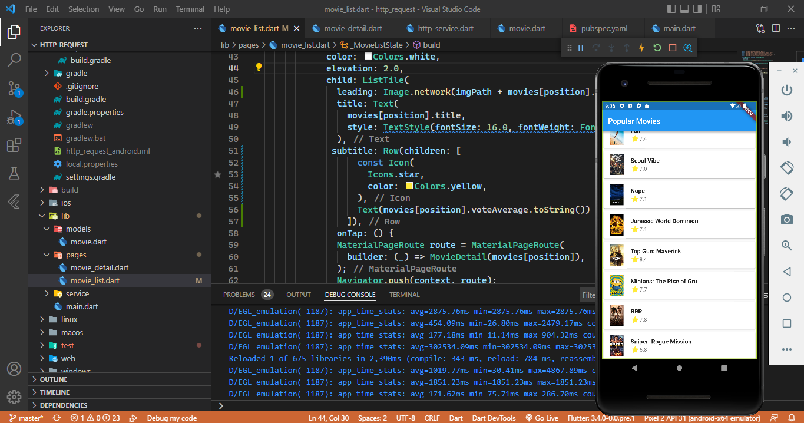

# http_request

A new Flutter project.

## Mengkoneksikan Aplikasi Flutter ke themoviedb dengan package http 

Pada Langkan ini Untuk mengkoneksikan aplikasi flutter yang dibuat ke rest api themoviedb.org, menambahkan permission internet pada android manifest cari lah file android manifest.xml pada folder, membuat file baru baru “pages” pada folder lib dan buat sebuah file 
movie_list.dart, membuat  helper
class untuk konek ke rest api themoviedb.
## Membuat model untuk response http

Pada Langkah ini membuat folder models didalam folder lib -> movie.dart,membuat sebuah class movie lengkap dengan variabel dan
construktor, membuat sebuah function untuk mengkonversi json menjadi response yang sesuai dengan class movie. 

## Membuat halaman list Populer Movie 
pada langkah list view pada widget movie list mengunakan widget  list view dan card
### Menampilkan hasil list Populer Movie

### Challenge menambahkan gambar dari response api ke listview

## Membuat halaman detail Populer Movie  
Untuk membuat perpindahan dari movie list ke movie detail buatlah onTap event di listview pada movie list. 

### Modifikasi 
Untuk memodifikasi tampilan mengunakan widget GridView yang bisa menampilkan hasil seperti gambar dibawah ini

 
